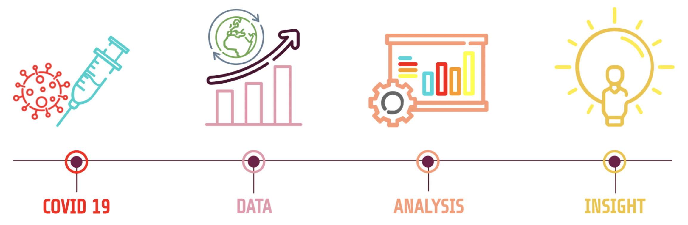
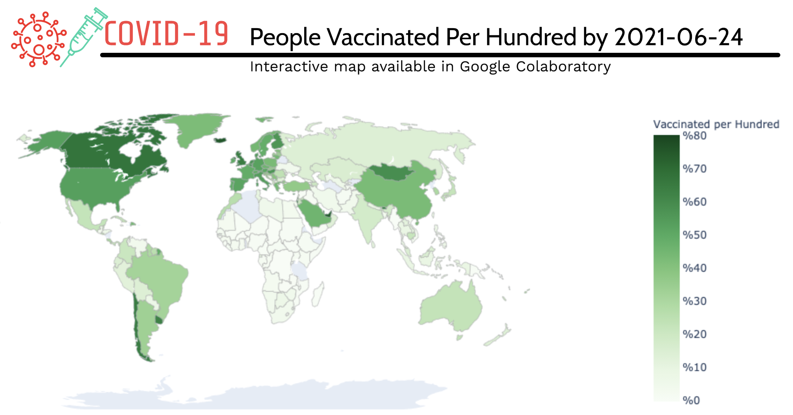
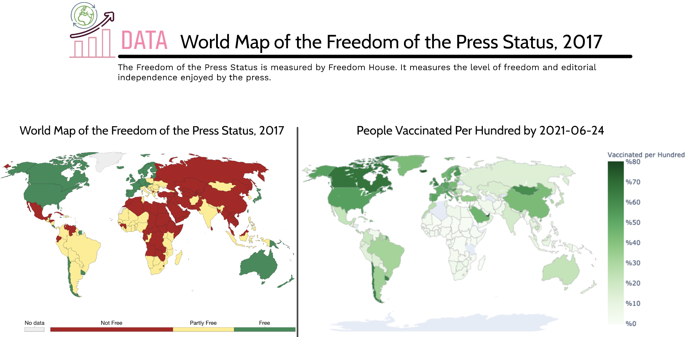
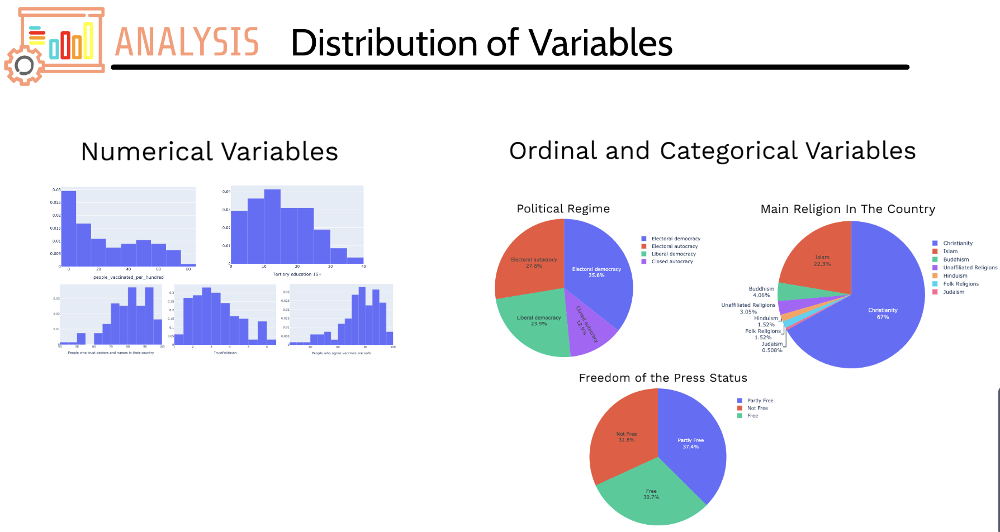
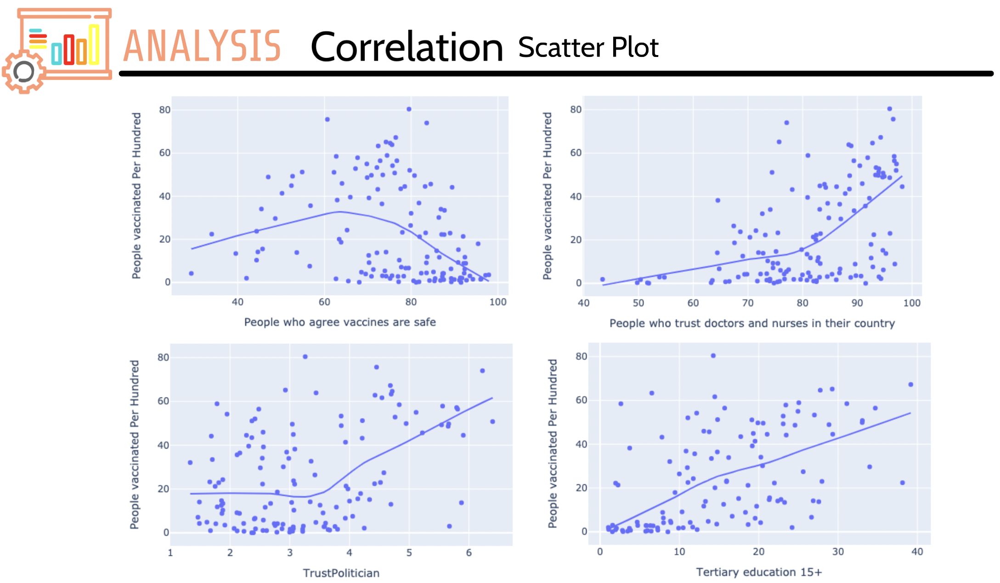
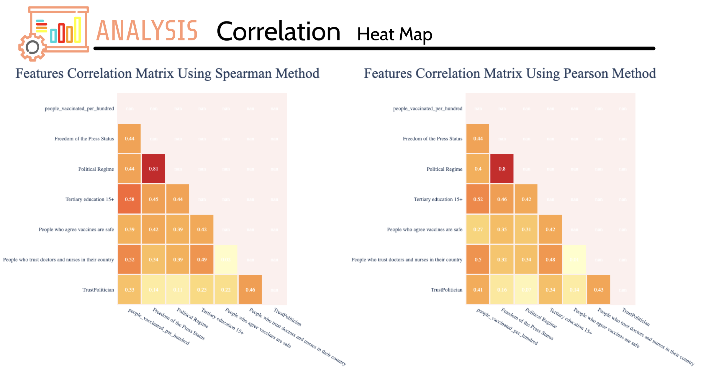
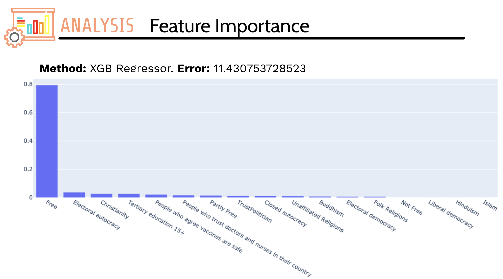
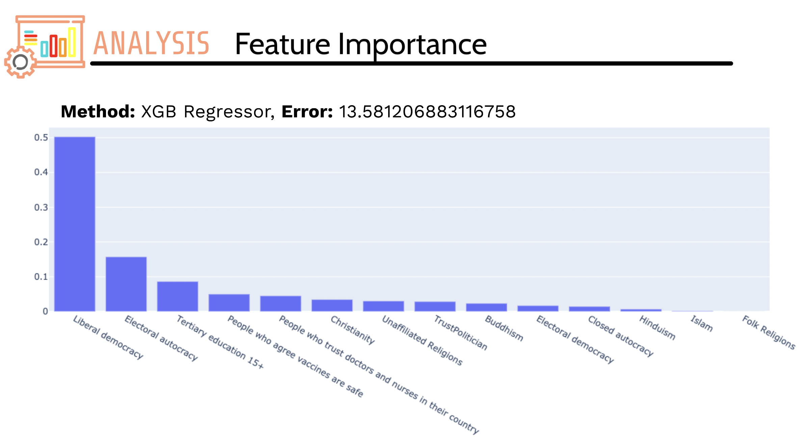

# 
 🦠💉Identifying The Social And Political Correlates of COVID-19 Vaccination Around The World

## Table of Contents

* [About the Project](#about-the-project)
   * [Abstract](#abstract)
   * [Introduction](#introduction)
   * [Results](#results)
   * [Built With](#built-with)
* [Getting Started](#getting-started)
  * [Prerequisites](#prerequisites)
  * [Usage](#usage)
* [Contact](#contact)

<!-- ABOUT THE PROJECT -->
## About The Project

### Abstract
Here I present a data analysis on Covid-19 vaccination progress using machine learning and statistics. The primary goal is identifying and understanding the relations between the different political and social characteristics of a country and its vaccination rate to help decision-making in the future.

I group the reasons for the uneven distribution of vaccination around the world into two categories of **political** and **social** reasons. The political reasons represent the government's inadequacy and the social reasons represent vaccine hesitancy.

Although correlation is not causation, we can still gain an insightful understanding of this matter. Figuring out what's causing the relationship would require richer research.
___
### Introduction
Severe acute respiratory syndrome coronavirus 2 (SARS-CoV-2), the virus that causes COVID-19, reached pandemic status on March 11th, 2020. As of July 17th, 2021, the virus had spread to 213 countries and territories, infected over 190 million people, and resulted in over 4.08 million people deaths worldwide. The global solutions to slow the spread of the virus are social distancing and global vaccination.

As COVID-19 is taking lives and damaging the economy, countries are trying to get the vaccination rate to above 70% as fast as possible. While some countries are close to achieving this goal, others are failing.

Using data extracted from [Our World in Data](https://ourworldindata.org/) we examine the possible correlations between the following features and the people vaccinated per hundred in each country:

**Political features:** Freedom of the press status, Political regimes, Main religion, Trust in politicians
**Social features:** Believe in vaccine safety, Higher education, Trust in doctors and nurses

The Methods used are:
1. **Visualization** using choropleth maps, histograms, pie charts, and scatter plots, heat maps.

2. **Calculating the coefficient of correlation** using Spearman's Rank Correlation Coefficient and Pearson Correlation Coefficient.

3. **Feature importance method** using XGBoost regressor, Random Forest regressor, and Decision tree regressor in machine learning algorithms.

___
### Results
Using nationally representative data from the 204 countries around the world, I found a significant **positive correlation** between **people vaccinated per hundred** and **freedom of the press status** for a given country.

**Political features** have a **stronger** correlation with people vaccinated per hundred than **social features**.

People more likely to be vaccinated from countries that:
1. The press has the freedom
2. Has Liberal democracy or Electoral autocracy.
3. More people have tertiary education.
4. More people agree with vaccine safety.

For future short-term or long-term plans to get more countries fully vaccinated, we have to first **democratize** the countries and ensure freedom of the press. For countries that already are democratized, we have to encourage people to pursue **higher education** after high school and expand people's medical knowledge to increase their **trust in doctors and nurses** and **vaccine safety**.
___

### Built With
* [Google Colaboratory](https://colab.research.google.com/)
* [Python 3](https://www.python.org/)
* [Scikit Learn](https://scikit-learn.org/stable/)
* [Pandas](https://pandas.pydata.org/)
* [NumPy](https://numpy.org/)
* [Matplotlib](https://matplotlib.org/)
*  [Plotly](https://plotly.com/)
*  [IPython](https://ipython.org/)

  
<!-- GETTING STARTED -->
## Getting Started

### Prerequisites
 - Google Colaboratory

### Usage
Open **[Identifying_The_Social_And_Political_Correlates_of_COVID_19_Vaccination_Around_The_World.ipynb](https://github.com/LadyPary/CovidVaccineCorrelation/blob/main/Identifying_The_Social_And_Political_Correlates_of_COVID_19_Vaccination_Around_The_World.ipynb)**.
Then click on the **Open in Colab** badge. Please note that you need a google account to use colab but you do not need to be familiar with colab.

Click on *Runtime -> Run All*  to run the program on datasets provided in [Data](https://github.com/LadyPary/CovidVaccineCorrelation/tree/main/Data) folder. 

You can interact with every plot in the output.

<!-- CONTACT -->
## Contact
If you have any further questions, please contact me via email.

Parisa Rabbany - Parisa.Rabbany.pr@gmail.com
